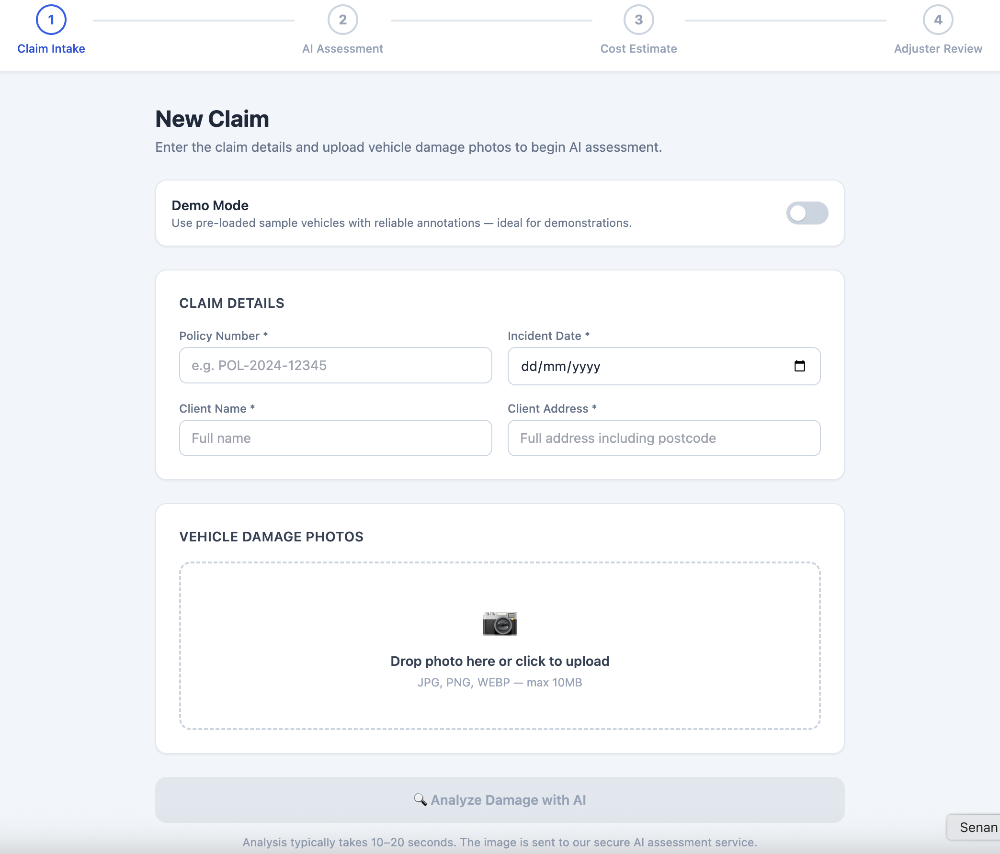
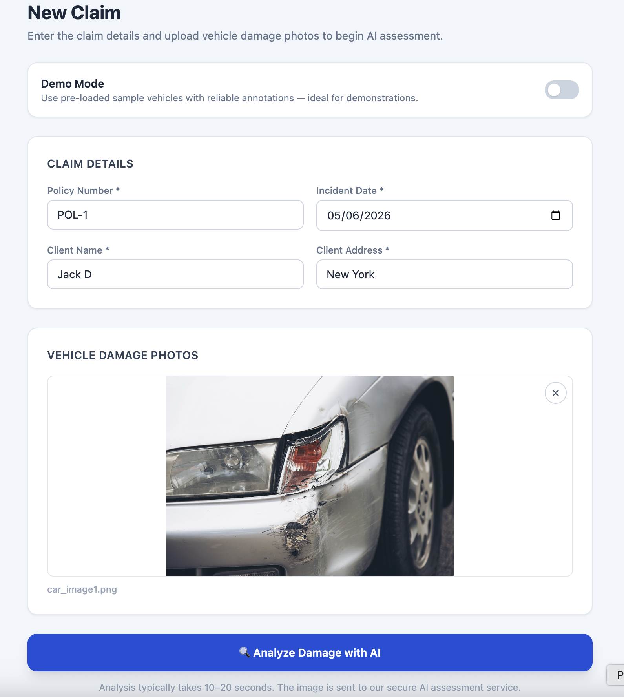
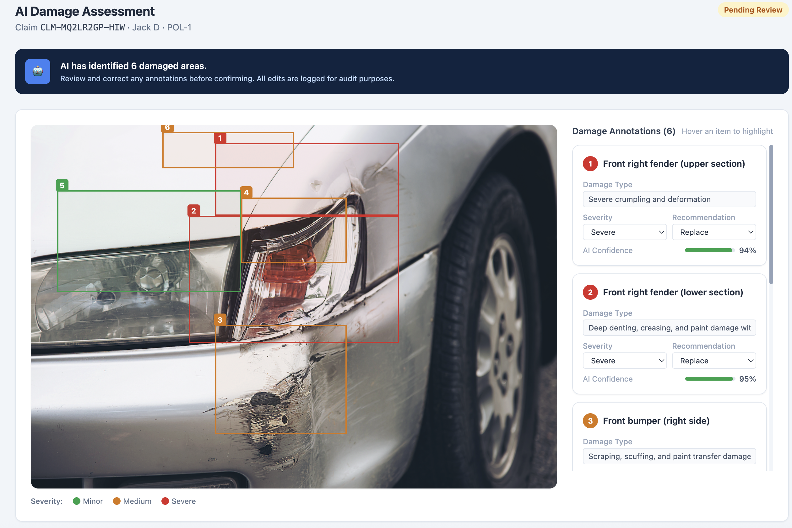
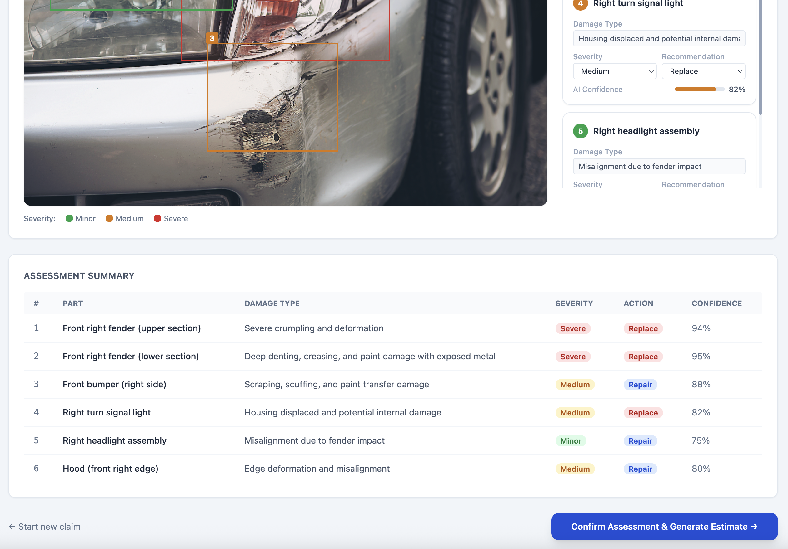
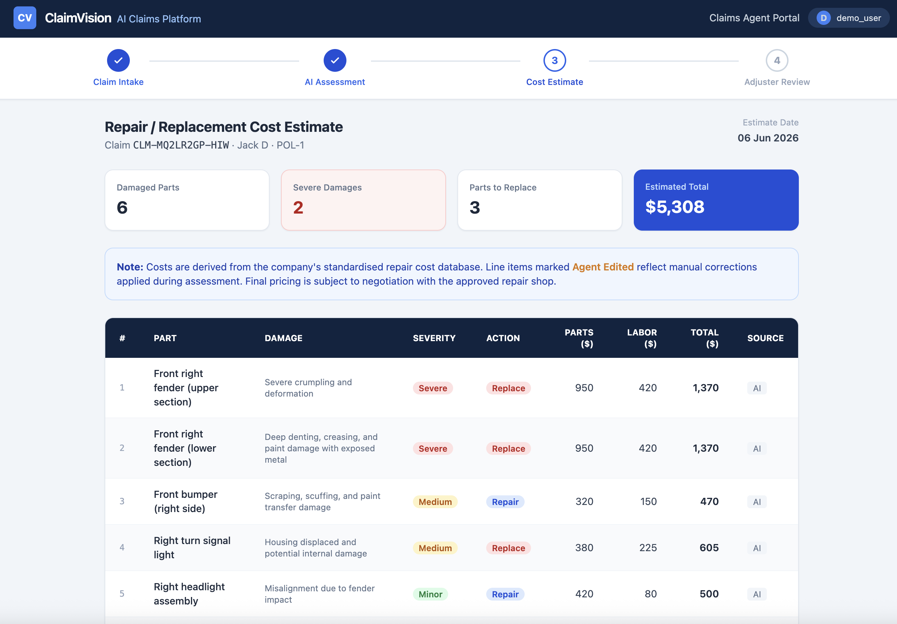
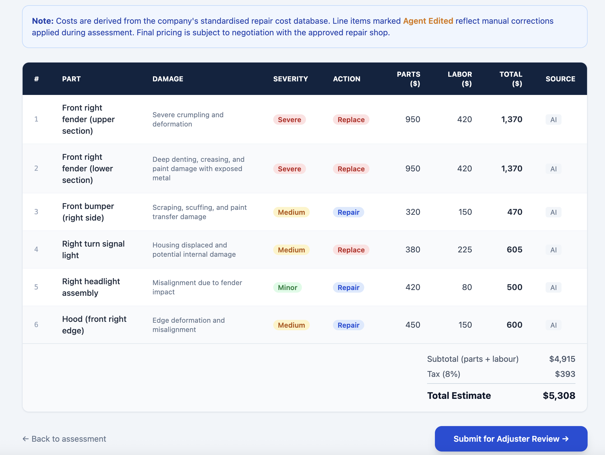
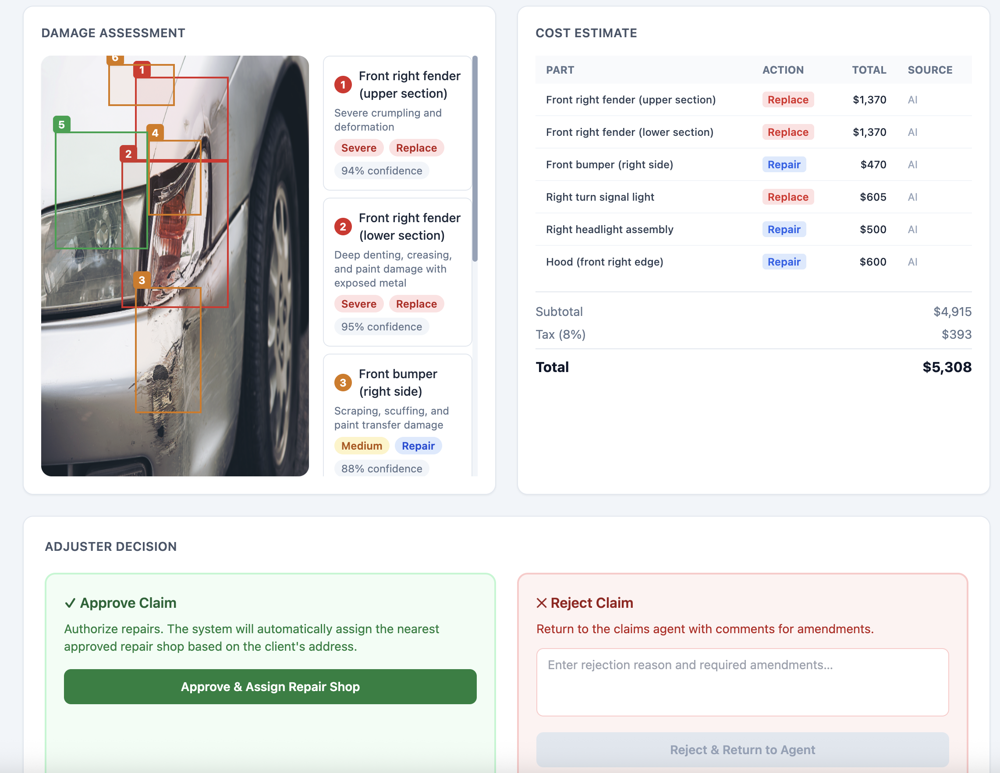

# ClaimVision AI — Car Insurance Claims Prototype

An AI-powered car insurance claims assessment prototype built with Next.js 14 and the Anthropic Claude vision API.

## What It Does

This prototype demonstrates the core claims agent workflow:

1. **Claim Intake** — Agent enters policy details and uploads vehicle damage photos
2. **AI Assessment** — Claude vision API analyses the image and returns bounding box annotations for each damaged area, labelled with part name, damage type, severity, repair vs. replace recommendation, and confidence score
3. **Cost Estimate** — The system queries a mock internal repair cost database to generate a line-item estimate
4. **Adjuster Review** — Senior adjuster approves or rejects the claim; approval triggers automatic repair shop assignment

---

## Tech Stack

- **Framework:** Next.js 14 (App Router)
- **Styling:** Tailwind CSS
- **AI:** Anthropic Claude Vision API (`claude-opus-4-5`)
- **State:** localStorage (prototype — no database required)

---

## Quick Start

### 1. Clone and install

```bash
git clone https://github.com/YOUR_USERNAME/claims-ai-prototype.git
cd claims-ai-prototype
npm install
```

### 2. Configure your API key

```bash
cp .env.example .env.local
```

Open `.env.local` and add your Anthropic API key:

```
ANTHROPIC_API_KEY=sk-ant-your-key-here
```

Get your key at: [https://console.anthropic.com](https://console.anthropic.com)

### 3. Run the development server

```bash
npm run dev
```

Open [http://localhost:3000](http://localhost:3000) in your browser.

---

## Live AI Mode

With your API key configured, upload any car damage photo and Claude will:

1. Identify all visible damaged areas
2. Draw bounding boxes around each area
3. Annotate each area with: part name, damage type, severity, repair/replace recommendation, and confidence %

**Important note on bounding boxes:** Claude's vision model returns approximate bounding box coordinates. These are good estimates but not pixel-perfect, as Claude is a general-purpose vision model rather than a dedicated object detection model. In a production system, a fine-tuned computer vision model (e.g. YOLO) would be used for precise localization, with Claude handling the semantic labelling and reasoning layer on top.

---

## Demo Mode (No API Key Required)

The app includes a **Demo Mode** with three pre-loaded accident scenarios:

- **Front-End Collision** 
- **Side Swipe Incident** 
- **Rear-End Impact** 

Toggle **Demo Mode** on the intake page to use pre-defined, annotations without making any API calls. 
Basically, use this mode if you were not able to get the Live AI mode to run (e.g. if you couldn't configure the Anthropic key)

---


## Project Structure

```
claims-ai-prototype/
├── app/
│   ├── layout.js              # Root layout with navigation
│   ├── page.js                # Redirects to /claims/new
│   ├── globals.css
│   ├── api/assess/route.js    # Anthropic vision API route
│   └── claims/
│       ├── new/page.js        # Step 1: Claim intake & photo upload
│       └── [id]/
│           ├── assessment/    # Step 2: AI damage assessment
│           ├── estimate/      # Step 3: Cost estimate
│           └── adjuster/      # Step 4: Adjuster review & decision
├── components/
│   ├── StepIndicator.jsx      # Progress steps component
│   └── AnnotatedImage.jsx     # Image with bounding box overlay + side panel
└── lib/
    ├── store.js               # localStorage state management
    ├── repairDatabase.js      # Mock internal repair cost database
    └── demoData.js            # Pre-defined demo scenarios
```

---

## Key Design Decisions

**Numbered markers instead of full annotation text on image**
Bounding boxes show a numbered badge only, keeping the image readable even with multiple damaged areas. Full annotation details appear in the editable side panel.

**Color-coded by severity**

- 🟢 Green — Minor
- 🟡 Amber — Medium
- 🔴 Red — Severe

**Agent correction logging**
Any annotation field edited by the agent is flagged as "Agent Edited" throughout the workflow, including in the cost estimate table and adjuster review. This creates an auditable trail.

**Every claim goes to adjuster review**
No automated routing based on confidence scores. Every claim is reviewed by a senior adjuster before authorization, ensuring consistent human oversight.

**Automatic repair shop assignment on approval**
On adjuster approval, the nearest approved repair shop is selected based on the client's address captured during intake.

---

## Screenshots




-----



-----



-----



-----



-----



-----




---

## Limitations (Prototype Scope)

- No persistent database — state is stored in localStorage and resets between browser sessions
- No authentication or user management
- Repair cost database is mocked — not connected to a real pricing system
- Single image upload per claim — production would support multi-angle photo sets
- Repair shop selection is simulated — production would use a geolocation API

---

## License

MIT — built as a take-home prototype. Not for production use.